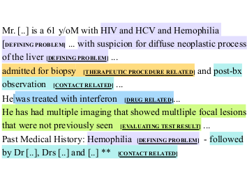

# MedDec: A Dataset for Extracting Medical Decisions from Discharge Summaries



This is the code and dataset described in **[MedDec (Elgaar et al., Findings of ACL: ACL 2024)](https://aclanthology.org/2024.findings-acl.975/)**.

MedDec is the first dataset specifically developed for extracting and classifying medical decisions from clinical notes. It includes 451 expert-annotated annotated discharge summaries from the MIMIC-III dataset, offering a valuable resource for understanding and facilitating clinical decision-making.

# Dataset

> [!NOTE]
> Currently under review on PhysioNet. Please check back on September 15, 2024.

The dataset is made available through this link: **[https://physionet.org/TBD](https://physionet.org/)**.

The user must sign a data usage agreement before accessing the dataset.

### Phenotypes Annotations

The phenotype annotations used in the paper are available here: [https://physionet.org/content/phenotype-annotations-mimic/1.20.03/](https://physionet.org/content/phenotype-annotations-mimic/1.20.03/).

# Installation

```
pip install -r requirements.txt
```

# Running the Baselines

To train the baselines, run the following command:
```
python main.py --label_encoding multiclass --model_name google/electra-base-discriminator --total_steps 5000 --lr 4e-5
```

To evaluate the baselines, run the following command:
```
python main.py --eval_only --ckpt ./checkpoints/[datetime]-[model_name]
```

## Arguments

- `data_dir`: The directory where the dataset is stored. The default is `./data/`.
- `pheno_path`: The path to the phenotype annotations. The default is `./ACTdb102003.csv`.
- `task`: `token` is the token classification task (decision extraction), and `seq` is the sequence classification task (phenotype prediction). The default is `token`.
- `eval_only`: Whether to evaluate the model only. `--ckpt` should be provided. The default is `False`.
- `label_encoding`: `multiclass`, `bo` (beginning inside outside), or `boe` (beginning outside end). The default is `multiclass`.
- `truncate_train`: Truncate the training sequences to a maximum length. Otherwise, the sequences are randomly chunked at training time. The default is `False`.
- `truncate_eval`: Truncate the evaluation sequences to a maximum length. The default is `False`.
- `use_crf`: Whether to use a CRF layer. The default is `False`.
- `model_name`: The name of the model from Hugging Face Transformers
- `total_steps`: The number of training steps
- `lr`: The learning rate
- `batch_size`: The batch size
- `seed`: The random seed


# Citation

If you use this dataset or code, please cite the following paper:

```
@inproceedings{elgaar-etal-2024-meddec,
    title = "{M}ed{D}ec: A Dataset for Extracting Medical Decisions from Discharge Summaries",
    author = "Elgaar, Mohamed  and
      Cheng, Jiali  and
      Vakil, Nidhi  and
      Amiri, Hadi  and
      Celi, Leo Anthony",
    editor = "Ku, Lun-Wei  and
      Martins, Andre  and
      Srikumar, Vivek",
    booktitle = "Findings of the Association for Computational Linguistics ACL 2024",
    month = aug,
    year = "2024",
    address = "Bangkok, Thailand and virtual meeting",
    publisher = "Association for Computational Linguistics",
    url = "https://aclanthology.org/2024.findings-acl.975",
    pages = "16442--16455",
}
```
